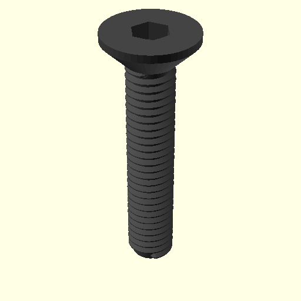
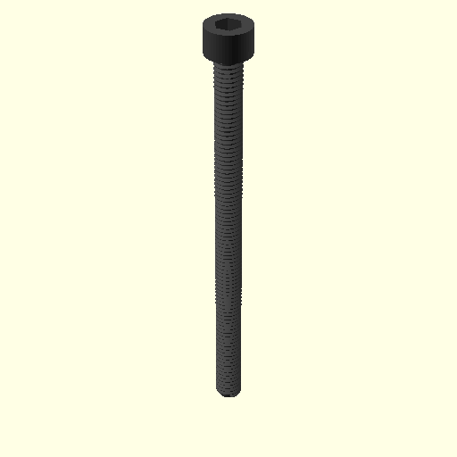

# oomp_hardware_screw_version_5

Generated screw part definitions and 3D outputs for the OOMLout/OOBB hardware catalog.

## Overview

This repository stores a catalog of screw variants and the generated files that go with them. The source data in `parts_source/` defines the screw families and sizes, and the generated `parts/` folders contain metadata, OpenSCAD files, preview images, and, for some parts, STL exports.

This repository is part of the larger [oomlout_oomp_version_5](https://github.com/oomlout/oomlout_oomp_version_5) toolchain for building reusable hardware part libraries, rather than a standalone Python package.

## Example Images

Navigation preview:


Example generated parts:





## Quick Start

If you only want to browse the generated outputs, start in:

- `parts/` for per-part folders
- `navigation_oobb/` for a generated navigation tree

If you have the external OOMLout dependencies installed locally, the main entry points in this repo are:

```bash
python working.py
python action_make_all.py
```

From the source files, `working.py` orchestrates the populate, metadata, SCAD, and action steps.

## Repository Structure

```text
.
├── action_make_all.py         # convenience entry point for the full generation flow
├── working.py                 # main orchestration script
├── working_oomp_populate.py   # defines the screw variants to generate
├── working_oomp.py            # builds part folders from parts_source
├── working_scad.py            # generates screw geometry and SCAD outputs
├── scad_help.py               # SCAD generation and navigation helpers
├── parts_source/              # source definitions, one folder per screw variant
├── parts/                     # generated per-part outputs and metadata
├── navigation_oobb/           # generated navigation copy of selected outputs
└── source_file/               # templates and supporting source files
```

## Examples

Each generated part folder typically includes files such as:

- `working.yaml` for part metadata
- `thing.yaml` for the fuller generated object description
- `3dpr.scad` for the OpenSCAD source
- `3dpr.png` for a rendered preview
- `3dpr.stl` for printable geometry when STL export has been generated
- `label_oomp.svg` and `initial_generated_icon.png` for labeling/artwork assets

Example part folders:

- `parts/hardware_screw_countersunk_hex_head_black_m3_diameter_16_mm_length/`
- `parts/hardware_screw_socket_cap_hex_head_black_m6_diameter_90_mm_length/`

## Requirements

No packaged dependency file is included in this repository.

From the Python imports, regeneration appears to depend on:

- Python
- `PyYAML`
- OOMLout OOMP modules such as `oomp`, `oomp_helper`, and `oomp_populate_helper` from [oomlout_oomp_version_5](https://github.com/oomlout/oomlout_oomp_version_5)
- `oomlout_roboclick` from [oomlout_oomlout_roboclick](https://github.com/oomlout/oomlout_roboclick)
- `oobb` from [oomlout_oobb_version_5](https://github.com/oomlout/oomlout_oobb_version_5)

The generated SCAD workflow also appears to rely on the wider OOBB/BOSL2/OpenSCAD environment referenced by the output files.

## Development Notes

- `parts_source/` currently contains 124 source part folders.
- `parts/` currently contains 124 generated part folders.
- `working_oomp_populate.py` is where the screw size/style combinations are enumerated.
- `working_scad.py` loads generated `working.yaml` files from `parts/` and builds the part geometry.
- `scad_help.py` also creates the `navigation_oobb/` tree used for browsing generated outputs.

## License

No license file was found in this repository.
